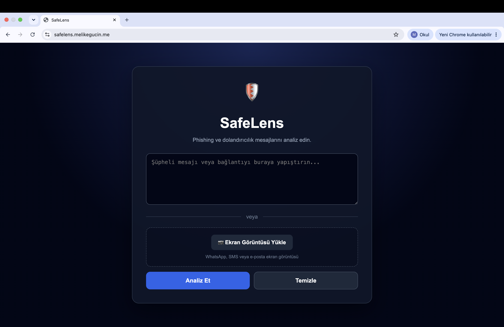
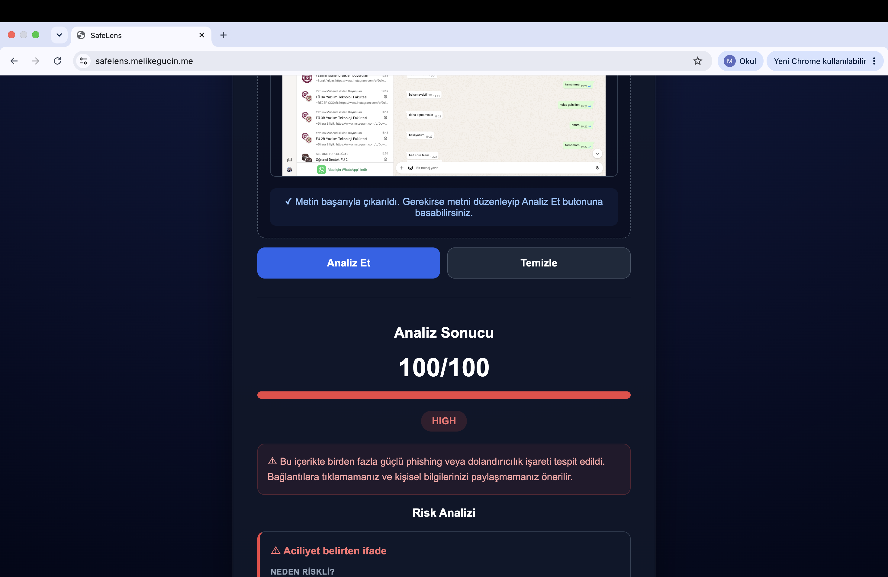
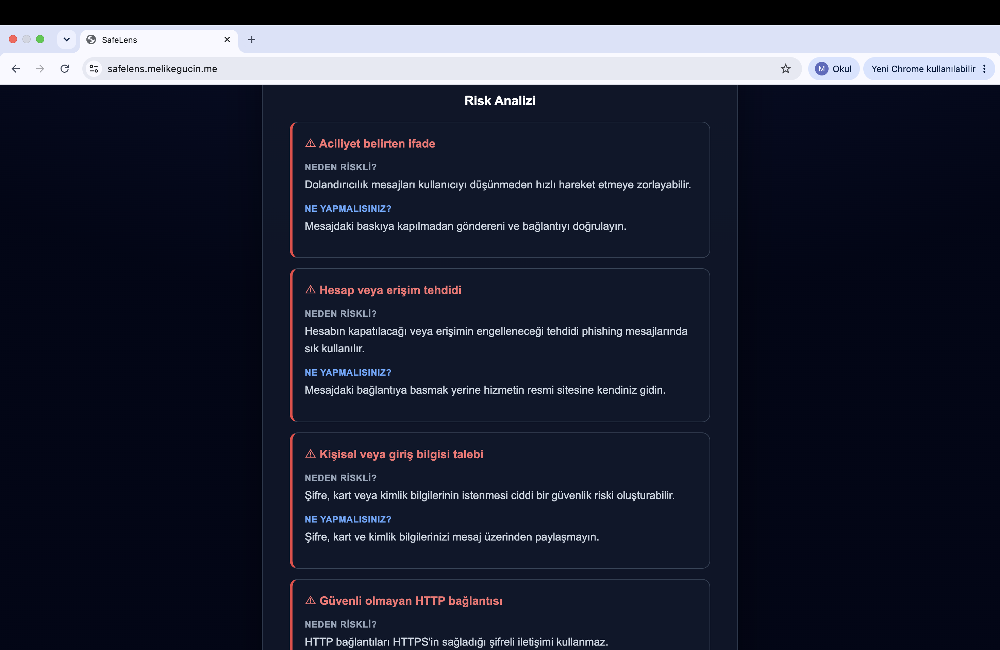

# 🛡️ SafeLens

SafeLens, phishing ve dolandırıcılık içerikli mesajları analiz ederek kullanıcıya risk skoru, tespit edilen güvenlik işaretleri ve alınabilecek önlemleri sunan web tabanlı bir güvenlik aracıdır.

🌐 **Live Demo:** https://safelens.melikegucin.me

## ✨ Özellikler

- Mesaj tabanlı phishing analizi
- URL ve bağlantı analizi
- 0–100 risk skoru
- LOW / MEDIUM / HIGH risk seviyeleri
- Şifre ve kişisel bilgi taleplerinin tespiti
- Risklerin neden tehlikeli olduğunun açıklanması
- Kullanıcıya güvenlik önerileri
- Ekran görüntüsünden OCR ile metin çıkarma
- WhatsApp, SMS ve e-posta ekran görüntüsü analizi
- FastAPI tabanlı backend
- Otomatik testler

## 🛠️ Kullanılan Teknolojiler

- Python
- FastAPI
- Uvicorn
- JavaScript
- HTML
- CSS
- Tesseract.js
- Pytest
- Render

## 🔗 Canlı Uygulama

SafeLens'i buradan deneyebilirsiniz:

### [🚀 SafeLens'i Canlı Deneyin](https://safelens.melikegucin.me)
## 📸 Ekran Görüntüleri

### Ana Ekran

### Yüksek Risk Analizi

### Ekran Görüntüsünden OCR Analizi

